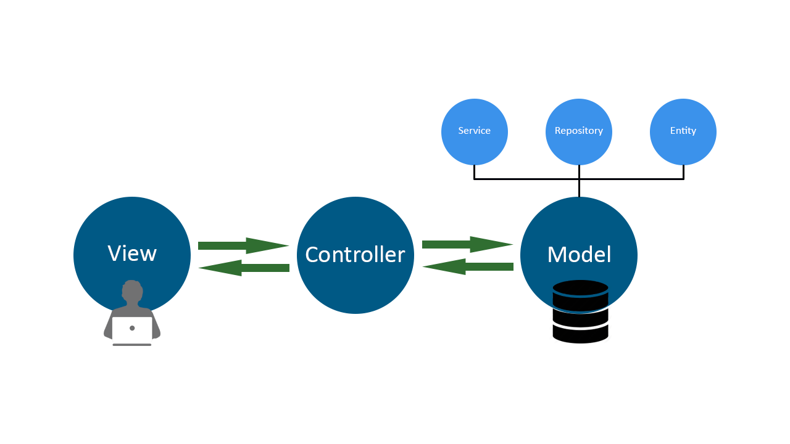
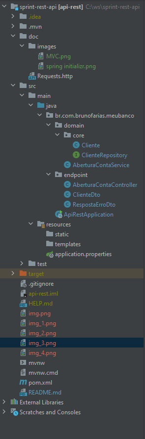
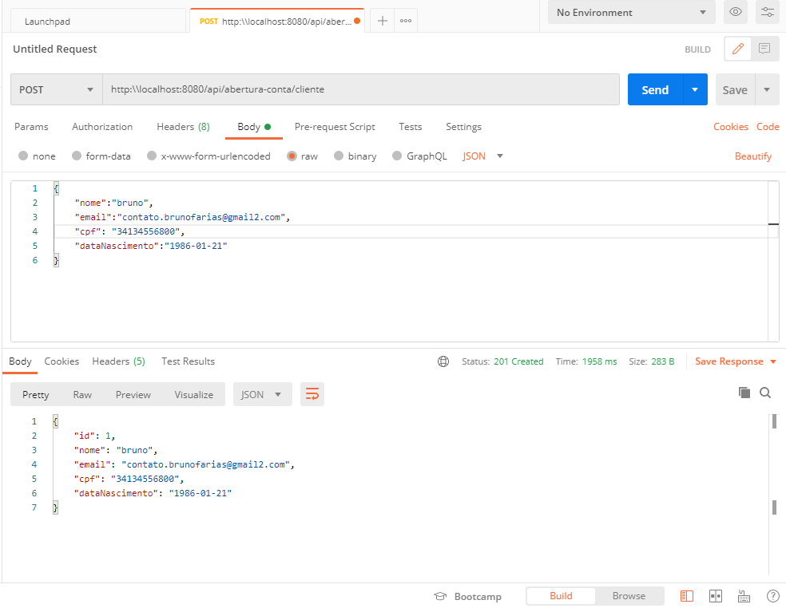
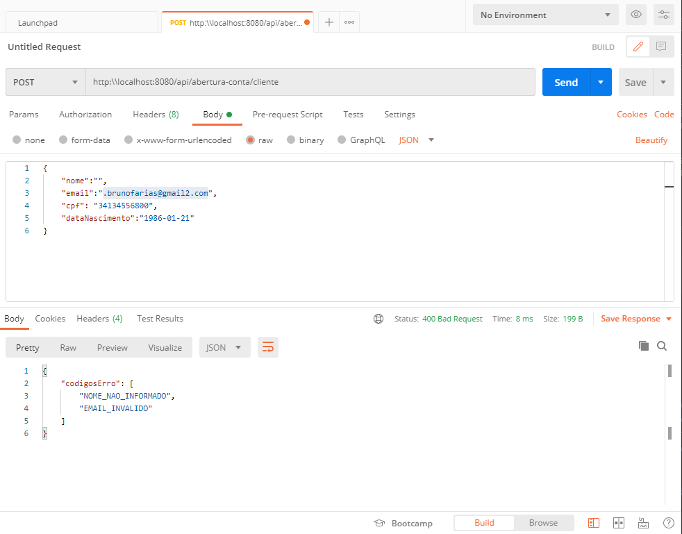

Uso do postman

# Construíndo uma API Rest com Java e Spring.

Imagine que você recebeu o seguinte desafio:

"Desenvolva uma API REST que suporte o processo de abertura de nova conta no banco. O primeiro passo desse fluxo é cadastrar os dados pessoais de uma pessoa. Precisamos de apenas algumas informações obrigatórias:
- Nome
- E-mail
- CPF
- Data de nascimento.

Caso os dados estejam corretos, é necessário gravar essas informações em um banco de dados relacional e retornar o status adequado para a aplicação cliente, que pode ser uma página web ou um aplicativo mobile.
Você deve fazer com que sua API devolva a resposta adequada para o caso de falha de validação."

E ai, vai encarar?

### Duas palavrinhas sobre o Java.
Já ouvi falar muito que o java é muito complexo, verboso, lento e blá... Não acredito nisso. Acredito que por ser uma poderosa e flexível linguagem de programação (e plataforma), existem muitos caminhos para chegar em uma mesma solução e o desafio é encontrar o conjunto de ferramentas que podem tornar o nosso trabalho mais àgil, seguro e de fácil manutenção para que consequentemente possamos nos concentrar no que mais interessa, gerar valor.

### Quais tecnologias vamos usar em nosso projeto.
- Spring Boot
- Spring MVC
- Spring JPA
- Spring Initializr
- Postgress (Docker)

### O que são estas tecnologias e por que parece ser uma boa idéia usá-las?

#### Spring Boot
O Spring boot é uma poderosa ferramenta que automatiza e simplifica toda a infraestrutura necessária para executamos nossa aplicação java, reduzindo o tempo e o esforço necessário para que tenhamos uma aplicação completa, segura e estável.
Além de tudo é muito fácil realizar customizações, como pelo arquivo application.properties por exemplo.
No caso do nosso projeto, vamos usar o ORM default do Spring Boot que é o Hibernate, também nos beneficiaremos do servidor de aplicação embutido, o TomCat.
#### Spring MVC
O padrão MVC (Model View Controller) esta amplamente consolidado, e no caso do Spring MVC, temos um framework completo que nos fornece diversos recursos no desenvolvimento de aplicações que necessitam de comunicação pelo protocolo http.
Dentre tais recursos podemos destacar, validações, binds, criação de endpoint (uri), tratamento de exceções, por exemplo.
Bom, parece que fica claro que faz total sentido utilizamos em nosso projeto.

### Spring JPA
O Spring JPA se baseia nos padrões JPA (Java Persitence API), implementando os recursos que necessitamos para uma integração com um banco de dados relacional. Essa integração é simples, com ótimos recursos como o CRUD Repository, que facilita e agiliza muito a persistencia e recuperaçao de dados do banco quase sem escrever código.
Bem, parece se enquandrar perfeitamente no nosso cenário, portanto, vamos usar...

### Spring Initializr
Pra quem achou que não dava para ficar ainda mais fácil... Surpresa!

O Spring Initializr é uma ferramenta que prepara toda a estrutura de pastas e alguns arquivos cruciais em nosso projeto. Basta informar algumas variavéis como nome do projeto, builder, linguagem, dependencias dentro outras coisinhas e ele cuida do resto. Feito isso, é só abrir o projeto em sua IDE e começar começar a diversão.

Acertou. Vamos usar.

### Postgress com Docker
Como sabemos, em nosso desafio precisamos persistir os dos dados em um banco de dados relacional, assim, iremos utilizar o postgres rodando em Docker. A decisão de executar em docker foi tomada pois neste modelo dispensa a necessidade de instalação e configuração do banco de dados localmente e atende perfeitamente a nossa necessidade. (em ambiente de desenvolvimento)

### Mão na massa	 
Primeiramente, vamos criar o nosso projeto utilizando o spring initializr acessando o site https://start.spring.io/ e informando os seguintes parametros.


Para prepara o banco de banco de dados vamos executar os passos a seguir.

``` shell
# Faz o download da imagem do Postgres.
docker pull postgres

# Executa um container do banco de dados.
docker run --name postgresql-container -p 5432:5432 -e POSTGRES_PASSWORD=MINHASENHA -d postgres’
```

Para finalizar a preparação do nosso ambiente, vamos configurar alguns parametros de nossa aplicação  no arquivo application.properties.

```
## application.properties

## Configurações do pool de conexões.
spring.datasource.hikari.connectionTimeout=20000
spring.datasource.hikari.maximumPoolSize=5

## PostgreSQL
spring.datasource.url=jdbc:postgresql://localhost:5432/postgres
spring.datasource.username=postgres
spring.datasource.password=${MINHASENHA}

##Recria as tabelas sempre que necessário. (Atencão, use apenas em modo de desenvolvimento)
spring.jpa.hibernate.ddl-auto = create
```

Agora vamos codificar nossas classes, é importante termos em mente o MVC.


### Camada Controller
Vamos criar a classe `AberturaContaController` que irá recepcionar nossas requições http.

Alguns pontos importantes são:

- @RestController -> Anotação Spring sobre a classe para disponibilizar os recursos necessários para recebimento de requisições http e com retornos no corpo http. (@RequestBody)
- @PostMapping -> Anotação sobre o metodo que será executando sempre que receber uma requisição http POST na uri especificada(`"/api/abertura-conta/cliente`). 
- @Validated -> Anotação sobre os parâmetros que "diz ao spring" que a validação deve ser realizada. (Bean Validation)
- @RequestBody -> Anotação sobre os parâmetros que define que eles devem ser recebidos via body do http.
- `class ClientDto` -> Classe que será utilizada para bind do JSON recebido na requisição em um objeto Java. 
- @ExceptionHandler -> Anotação sobre o método que captura e trata as exceções `MethodArgumentNotValidException` e `IllegalArgumentException` lançadas pelo spring e por nossa validação respectivamente, como a aplicação é muito simples não criamos uma exception customizada.
- HttpStatus -> Determina qual será o status HTTP retornado.

```java
package br.com.brunofarias.meubanco.endpoint;

import br.com.brunofarias.meubanco.domain.AberturaContaService;
import br.com.brunofarias.meubanco.domain.core.Cliente;
import org.springframework.http.HttpStatus;
import org.springframework.http.ResponseEntity;
import org.springframework.validation.annotation.Validated;
import org.springframework.web.bind.MethodArgumentNotValidException;
import org.springframework.web.bind.annotation.ExceptionHandler;
import org.springframework.web.bind.annotation.PostMapping;
import org.springframework.web.bind.annotation.RequestBody;
import org.springframework.web.bind.annotation.RestController;

import java.util.List;
import java.util.stream.Collectors;


@RestController
public class AberturaContaController {

    private final AberturaContaService aberturaContaService;

    public AberturaContaController(AberturaContaService aberturaContaService) {
        this.aberturaContaService = aberturaContaService;
    }

    @PostMapping("/api/abertura-conta/cliente")
    public ResponseEntity<Cliente> cadastraCliente(@Validated @RequestBody ClienteDto clienteDto) {
        Cliente cliente = aberturaContaService.cadastraCliente(
                clienteDto.getNome(),
                clienteDto.getEmail(),
                clienteDto.getCpf(),
                clienteDto.getDataNascimento()
        );
        return new ResponseEntity<>(cliente, HttpStatus.CREATED);
    }

    @ExceptionHandler(MethodArgumentNotValidException.class)
    public ResponseEntity<RespostaErroDto> capturaValidacoesBeanValidation(MethodArgumentNotValidException ex) {
        List<String> codigosErro = ex.getBindingResult().getAllErrors().stream()
                .map(error -> error.getDefaultMessage())
                .collect(Collectors.toList());

        return new ResponseEntity(new RespostaErroDto(codigosErro), HttpStatus.BAD_REQUEST);
    }

    @ExceptionHandler(IllegalArgumentException.class)
    public ResponseEntity<RespostaErroDto> capturaValidacoesBeanValidation(IllegalArgumentException ex) {
        return new ResponseEntity(ex.getMessage(), HttpStatus.BAD_REQUEST);
    }

}
```

DTO (Data Transfer Object) utilizado para o bind, ou seja, transformação dos dados recebidos pela requisição em um objeto java e já utilizando o Bean Validation com as anotações @NotBlank, @Email e @Past.
Eu gosto de colocar "codigo" no parametro message, no meu entendimento, é mais adequado que a view (web ou mobile) receba um código e defina a mensagem a ser apresentada ao usuario.

```java
package br.com.brunofarias.meubanco.endpoint;


import javax.validation.constraints.Email;
import javax.validation.constraints.NotBlank;
import javax.validation.constraints.Past;
import java.time.LocalDate;
import java.util.Objects;

public class ClienteDto {

    @NotBlank(message = "NOME_NAO_INFORMADO")
    private String nome;
    @Email(message = "EMAIL_INVALIDO")
    private String email;
    @NotBlank(message = "CPF_NAO_INFORMADO.")
    private String cpf;
    @Past(message = "DATA_NASCIMENTO_INVALIDA.")
    private LocalDate dataNascimento;

    public ClienteDto(@NotBlank(message = "NOME_NAO_INFORMADO") String nome, @Email(message = "EMAIL_INVALIDO") String email, @NotBlank(message = "CPF_NAO_INFORMADO.") String cpf, @Past(message = "DATA_NASCIMENTO_INVALIDA.") LocalDate dataNascimento) {
        this.nome = nome;
        this.email = email;
        this.cpf = cpf;
        this.dataNascimento = dataNascimento;
    }

    public String getNome() {
        return nome;
    }

    public void setNome(String nome) {
        this.nome = nome;
    }

    public String getEmail() {
        return email;
    }

    public void setEmail(String email) {
        this.email = email;
    }

    public String getCpf() {
        return cpf;
    }

    public void setCpf(String cpf) {
        this.cpf = cpf;
    }

    public LocalDate getDataNascimento() {
        return dataNascimento;
    }

    public void setDataNascimento(LocalDate dataNascimento) {
        this.dataNascimento = dataNascimento;
    }

    @Override
    public boolean equals(Object o) {
        if (this == o) return true;
        if (o == null || getClass() != o.getClass()) return false;
        ClienteDto that = (ClienteDto) o;
        return Objects.equals(nome, that.nome) && Objects.equals(email, that.email) && Objects.equals(cpf, that.cpf) && Objects.equals(dataNascimento, that.dataNascimento);
    }

    @Override
    public int hashCode() {
        return Objects.hash(nome, email, cpf, dataNascimento);
    }
}
```

DTO (Data Transfer Object) utilizado no retorno das requisições, é interessante padronizar um tipo de retorno para facilitar o consumo da API.
```java
package br.com.brunofarias.meubanco.endpoint;

import java.util.List;

public class RespostaErroDto {
    private List<String> codigosErro;

    public RespostaErroDto(List<String> codigosErro) {
        this.codigosErro = codigosErro;
    }

    public List<String> getCodigosErro() {
        return codigosErro;
    }
}

```

### Camada Model

#### Classe Cliente
Nossa classe cliente possui todos os campos demandados pelo negócio mais o id de banco de dados. No caso de uma `@Entity` é muito importate definirmos a identidade adequada através do `equals` e do `hasCode`.

- @Entity -> Anotação sobre a classe que determina que ela sera persistida e gerenciada pelo JPA/HIBERNATE.
- @Id -> Anotação sobre o field definindo que ele sera utilizado como primary key no banco de dados.
- @GeneratedValue -> Anotação sobre o field definindo como o id sera gerado, neste caso, a critério do banco de dados.

```java
package br.com.brunofarias.meubanco.domain.core;

import javax.persistence.Entity;
import javax.persistence.GeneratedValue;
import javax.persistence.GenerationType;
import javax.persistence.Id;
import java.time.LocalDate;
import java.util.Objects;

@Entity
public class Cliente {

    @Id
    @GeneratedValue(strategy= GenerationType.AUTO)
    private Integer id;
    private String nome;
    private String email;
    private String cpf;
    private LocalDate dataNascimento;

    public Cliente() {
    }

    public Cliente(String nome, String email, String cpf, LocalDate dataNascimento) {
        this.nome = nome;
        this.email = email;
        this.cpf = cpf;
        this.dataNascimento = dataNascimento;
    }

    public Integer getId() {
        return id;
    }

    public void setId(Integer id) {
        this.id = id;
    }

    public String getNome() {
        return nome;
    }

    public void setNome(String nome) {
        this.nome = nome;
    }

    public String getEmail() {
        return email;
    }

    public void setEmail(String email) {
        this.email = email;
    }

    public String getCpf() {
        return cpf;
    }

    public void setCpf(String cpf) {
        this.cpf = cpf;
    }

    public LocalDate getDataNascimento() {
        return dataNascimento;
    }

    public void setDataNascimento(LocalDate dataNascimento) {
        this.dataNascimento = dataNascimento;
    }

    @Override
    public boolean equals(Object o) {
        if (this == o) return true;
        if (o == null || getClass() != o.getClass()) return false;
        Cliente cliente = (Cliente) o;
        return Objects.equals(cpf, cliente.cpf);
    }

    @Override
    public int hashCode() {
        return Objects.hash(cpf);
    }
}
```

####Classe ClienteRepository

Ao extender o CrudRepository o Spring já implementa uma série de metodos úteis como save e findById por exemplo, e para nossas validações de cpf e email criamos os métodos `existsByCpf` e `existsByEmail` que apenas ao usar a nomeclura do CrudRepository, já teremos o método "magicamente" implementado.
```java
package br.com.brunofarias.meubanco.domain.core;

import org.springframework.data.repository.CrudRepository;

public interface ClienteRepository extends CrudRepository<Cliente, Integer> {

    public Boolean existsByCpf(String cpf);

    public Boolean existsByEmail(String email);

}
```

#### AberturaContaService

Aqui mantemos as regras de negócio, do nosso caso apenas fazemos algumas validações e em caso de sucesso persistimos no banco de dados.

```java
package br.com.brunofarias.meubanco.domain;

import br.com.brunofarias.meubanco.domain.core.Cliente;
import br.com.brunofarias.meubanco.domain.core.ClienteRepository;
import org.springframework.stereotype.Service;

import javax.transaction.Transactional;
import java.time.LocalDate;

@Service
public class AberturaContaService {
    private final ClienteRepository clienteRepository;

    public AberturaContaService(ClienteRepository clienteRepository) {
        this.clienteRepository = clienteRepository;
    }

    @Transactional
    public Cliente cadastraCliente(String nome, String email, String cpf, LocalDate dataNascimento) throws IllegalArgumentException {
        certificaQueClientePodeSerCadastrado(email, cpf);

        Cliente cliente = new Cliente(nome, email, cpf, dataNascimento);
        return clienteRepository.save(cliente);
    }

    private void certificaQueClientePodeSerCadastrado(String email, String cpf) {
        if (clienteRepository.existsByEmail(email)) {
            throw new IllegalArgumentException("EMAIL_JA_CADASTRADO");
        }

        if (clienteRepository.existsByCpf(cpf)) {
            throw new IllegalArgumentException("CPF_JA_CADASTRADO");
        }
    }
}
```

Para termos uma visão geral da distribuição de nossos arquivos, temos:


Certo, temos então uma requisção em caso de sucesso.


E uma com erro.



É isso ai, missão dada é missão cumprida. Ah! O código está disponível em https://github.com/bruno-vieira-farias/sprint-rest-api.git. Te espero por lá e até breve.